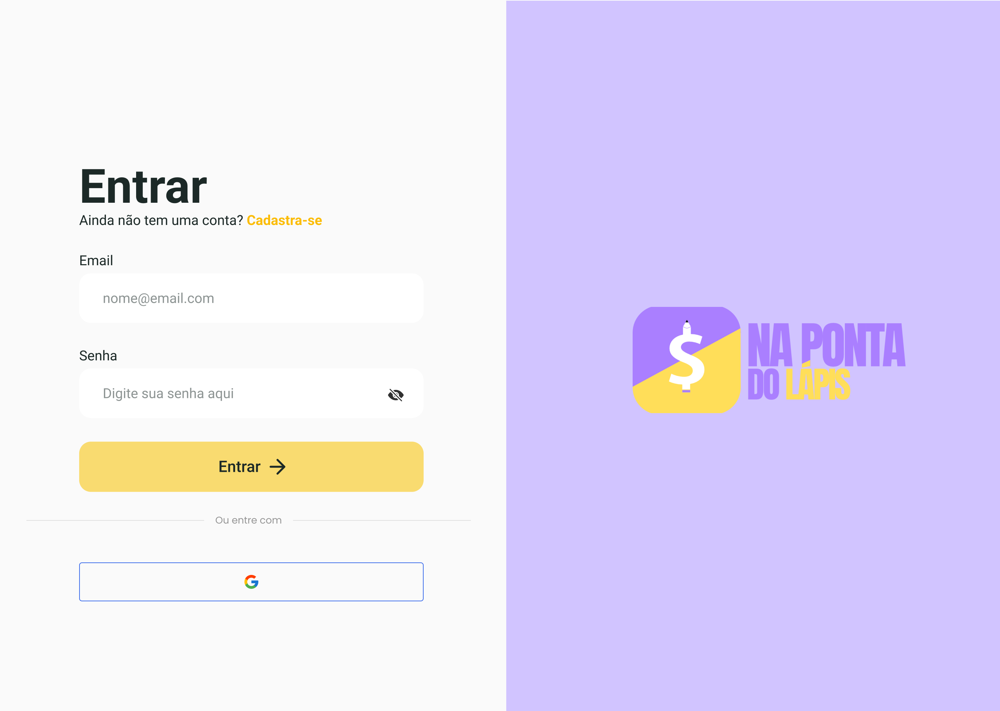
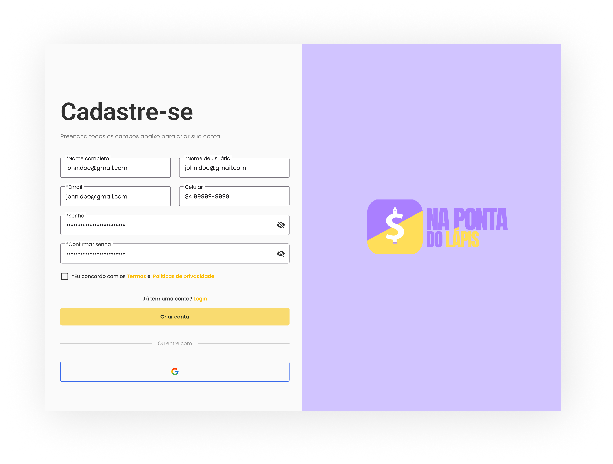
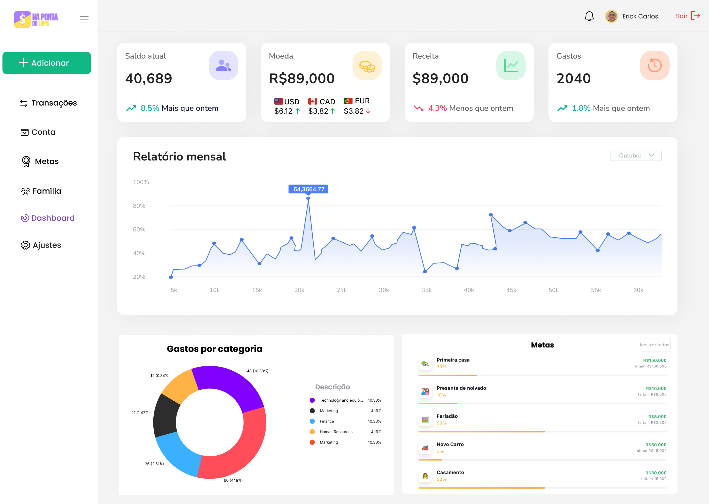
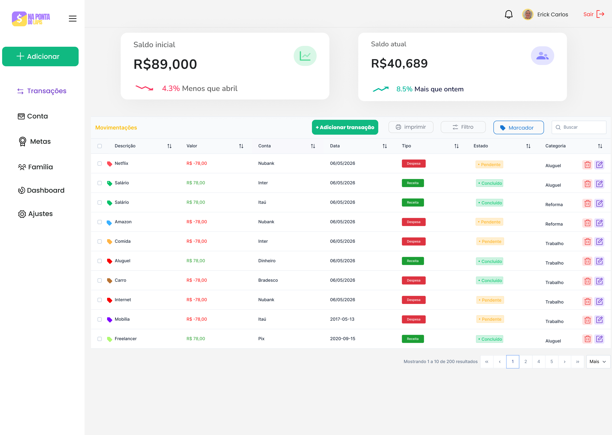
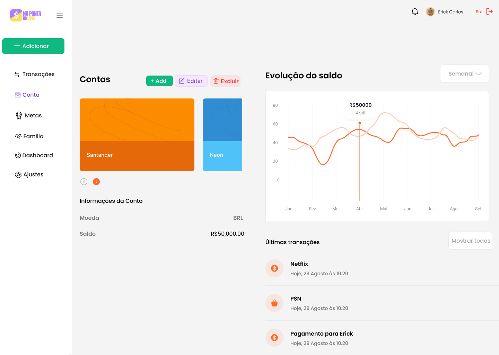
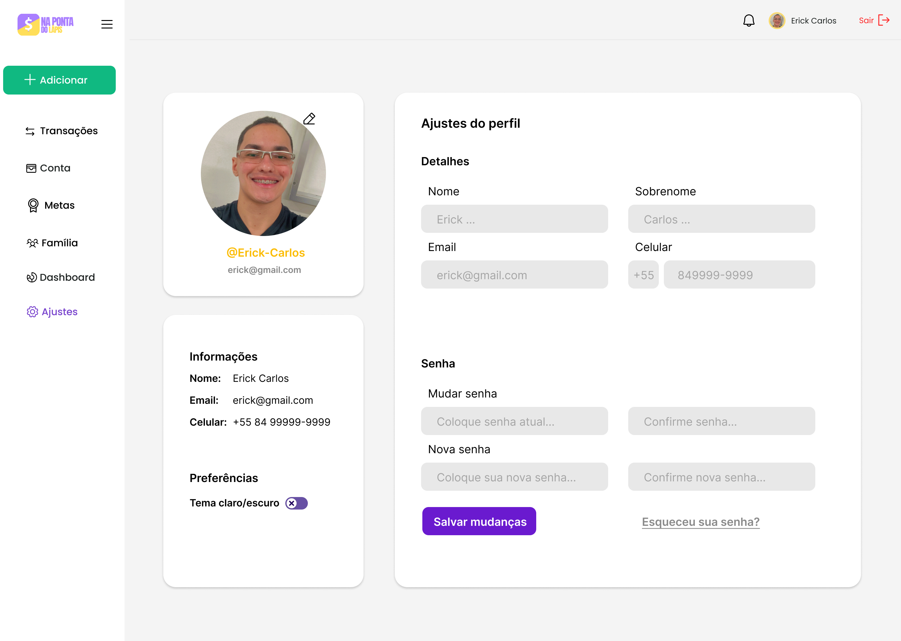

# Na Ponta do Lápis


Sistema web voltado para jovens que estão iniciando a vida adulta. A plataforma oferece ferramentas de controle financeiro, planejamento de gastos e educação financeira personalizada — ajudando o usuário a desenvolver hábitos saudáveis de gestão do dinheiro e construir uma base sólida para o crescimento pessoal e profissional.


## Landing Page


## Login


## Cadastro


## Dashboard


## Transação


## Conta


## Configuração


## Stack

- **Backend:** Java 21 + Spring Boot 3.5 + PostgreSQL (ou H2 em memória)
- **Frontend:** Angular 21 + PrimeNG + Tailwind CSS
- **Autenticação:** JWT (jjwt 0.12)
- **Docs da API:** Swagger UI em `/api/docs`

---

## Modo de Execução


###  DevContainer 

> Funciona no **VS Code** com a extensão *Dev Containers* instalada, ou direto no **GitHub Codespaces** sem instalar nada.

O DevContainer sobe automaticamente:
- Container Java 21 + Maven (backend)
- Container PostgreSQL 16 (banco `npl_db`, usuário/senha `postgres`)
- Node.js 24 com Angular CLI 21 (frontend)

As portas `8080` (Spring), `4200` (Angular) e `5432` (PostgreSQL) são encaminhadas automaticamente.

**Passos:**

1. Abra o repositório no VS Code e clique em **"Reopen in Container"** — ou abra no GitHub Codespaces.
2. Aguarde o container construir (primeira vez demora alguns minutos).
3. No terminal do container, entre na pasta do frontend e rode tudo de uma vez:
   ```bash
   cd frontend/na-ponta-do-lapis
   npm run dev
   ```
   Esse comando sobe o frontend e o backend em paralelo.

> **Observação (Codespaces):** A porta `4200` (Angular) tem que estar pública no codespace.


## URLs Úteis 

| Serviço | URL |
|---|---|
| Frontend Angular | http://localhost:4200 |
| Backend Spring | http://localhost:8080/api |
| Swagger UI | http://localhost:8080/api/docs |

---

## Equipe

| Nome |  |
|---|---|
| Bruno Dias |  |
| Eduardo Aguiar | |
| Erick Carlos | |
| Lucas Medeiros | |
| Pedro Gomes | |
| Vinicius Vasconcelos | |
| Wagner Souza | |

## Horário de Reuniões

- **Terça-Feira:** 14:30 às 16:00 — Presencial com o Orientador
- **Quarta-Feira:** 20:30 às 21:30 — Discord
- **Sábado:** 19:30 às 20:00 — Discord

## Documentação

[Link para os documentos do projeto](doc/documentacao.md)
