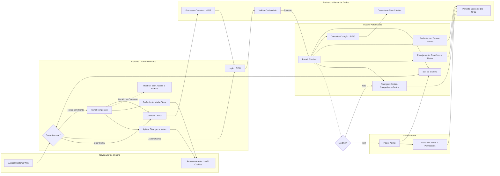

```mermaid
graph LR

    subgraph Cliente [Navegador do Usuário]
        Acesso[Acessar Sistema Web]
        SysCookie[Armazenamento Local / Cookies]
    end

    subgraph Unauth [Visitante / Não Autenticado]
        TipoAcesso{Como Acessar?}
        NovoCadastro[Cadastro - RF01]
        FazerLogin[Login - RF01]
        
        PainelTemp[Painel Temporário]
        AcoesTemp[Ações: Finanças e Metas]
        TemaTemp[Preferência: Mudar Tema]
        Restricao[Restrito: Sem Acesso à Família]
    end

    subgraph AuthUser [Usuário Autenticado]
        Painel[Painel Principal]
        AcoesFin[Finanças: Contas, Categorias e Gastos]
        AcoesPlan[Planejamento: Relatórios e Metas]
        AcoesExt[Preferências: Tema e Família]
        Cotacao[Consultar Cotação - RF10]
        Logout[Sair do Sistema]
    end

    subgraph Admin [Administrador]
        PainelAdmin[Painel Admin]
        AcoesAdmin[Gerenciar Posts e Permissões]
    end

    subgraph Sistema [Backend e Banco de Dados]
        SysCadastro[Processar Cadastro - NF03]
        SysLogin[Validar Credenciais]
        SysBD[Persistir Dados no BD - NF02]
        SysAPI[Consultar API de Câmbio]
    end

    %% Decisão Inicial
    Acesso --> TipoAcesso
    
    %% Fluxo de Autenticação Padrão
    TipoAcesso -- Criar Conta --> NovoCadastro
    NovoCadastro --> SysCadastro
    SysCadastro --> FazerLogin
    
    TipoAcesso -- Já tem Conta --> FazerLogin
    FazerLogin --> SysLogin
    SysLogin -- Sucesso --> Painel

    %% Fluxo da Sessão Temporária (Cookies)
    TipoAcesso -- Testar sem Conta --> PainelTemp
    PainelTemp --> AcoesTemp
    PainelTemp --> TemaTemp
    PainelTemp -.-> Restricao
    
    AcoesTemp --> SysCookie
    TemaTemp --> SysCookie
    
    %% Converter Visitante em Usuário
    PainelTemp -- Decidiu se Cadastrar --> NovoCadastro
    
    %% Fluxo do Usuário Logado
    Painel -.-> DeterminaPapel{É Admin?}
    DeterminaPapel -- Sim --> PainelAdmin
    DeterminaPapel -- Não --> AcoesFin
    
    Painel --> AcoesFin
    Painel --> AcoesPlan
    Painel --> AcoesExt
    Painel --> Cotacao

    AcoesFin --> SysBD
    AcoesPlan --> SysBD
    AcoesExt --> SysBD
    Cotacao --> SysAPI

    %% Fluxo do Administrador
    PainelAdmin --> AcoesAdmin
    AcoesAdmin --> SysBD

    %% Saída
    Painel --> Logout
    PainelAdmin --> Logout
    Logout --> TipoAcesso
```
