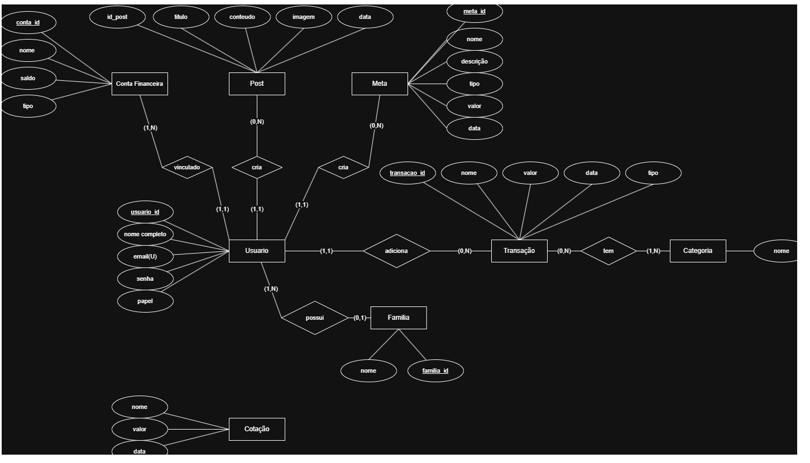
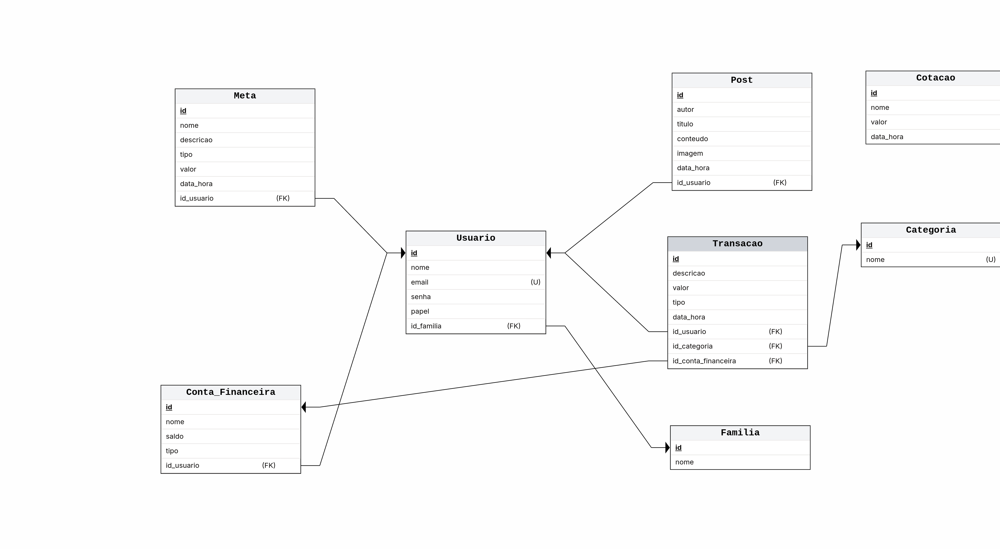

# Modelo de Dados

## Histórico de Revisões

| Data | Versão | Descrição | Autores |
| :--: | :----: | :-------: | :-----: |
| 30/10/2025 | 1.0 | Diagrama |  Lucas |
| - | - | - |  - |

## 1. Diagrama ER

>   

## 2. Modelo Relacional

> 

## 3. Dicionário de Dados

--- 
**Tabela** : [nome da tabela 1]

*Descrição* : ...

*Observações* : ...

| Colunas | Descrição | Tipo de Dado | Tamanho | Null | PK | FK | Unique | Identity | Default | Check | 
| ------- | --------- | ------------ | ------- | ---- | -- | -- | ------ | -------- | ------- | ----- |
| [nome da coluna] | [descrição da coluna] | [tipo_de_dado] | [tamanho - se necessário | &#9745;  | &#9744; | &#9744; | &#9744; | &#9744; | [default - se necessário] | [outras restrições - se necessário] | 

---
**Tabela** : [nome da tabela 2]

*Descrição* : ...

*Observações* : ...

| Colunas | Descrição | Tipo de Dado | Tamanho | Null | PK | FK | Unique | Identity | Default | Check |  
| ------- | --------- | ------------ | ------- | ---- | -- | -- | ------ | -------- | ------- | ----- |
| [nome da coluna] | [descrição da coluna] | [tipo_de_dado] | [tamanho - se necessário | &#9745;  | &#9744; | &#9744; | &#9744; | &#9744; | [default - se necessário] | [outras restrições - se necessário] |
