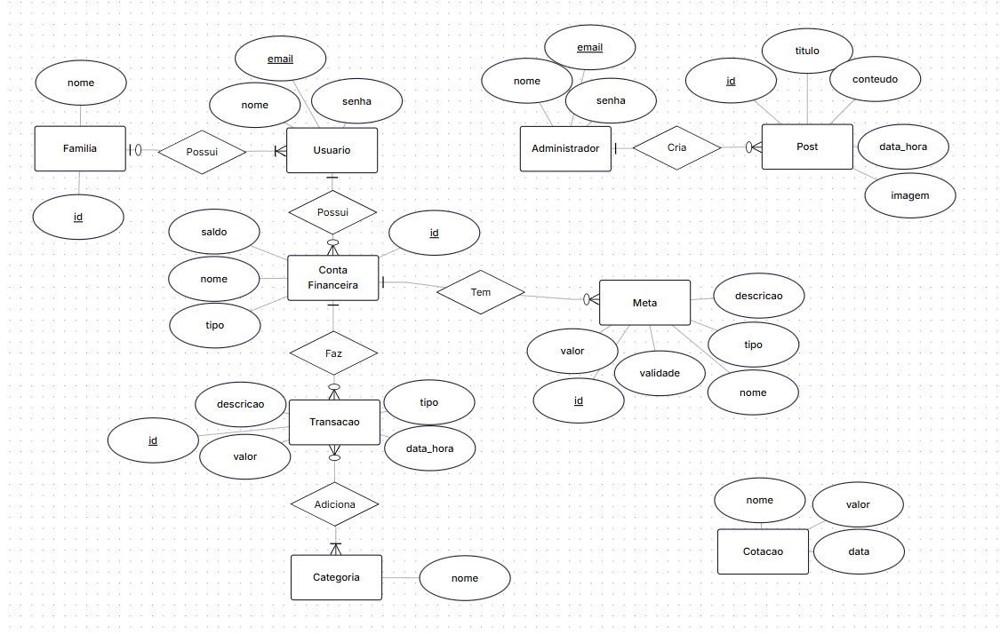

# Modelo de Dados

## Histórico de Revisões

| Data | Versão | Descrição | Autores |
| :--: | :----: | :-------: | :-----: |
| 30/10/2025 | 1.0 | Diagrama |  Lucas |
| - | - | - |  - |

## 1. Diagrama ER

>   

## 2. Modelo Relacional

> 

## 3. Dicionário de Dados

--- 
**Tabela** : [nome da tabela 1]

*Descrição* : ...

*Observações* : ...

| Colunas | Descrição | Tipo de Dado | Tamanho | Null | PK | FK | Unique | Identity | Default | Check | 
| ------- | --------- | ------------ | ------- | ---- | -- | -- | ------ | -------- | ------- | ----- |
| [nome da coluna] | [descrição da coluna] | [tipo_de_dado] | [tamanho - se necessário | &#9745;  | &#9744; | &#9744; | &#9744; | &#9744; | [default - se necessário] | [outras restrições - se necessário] | 

---

**Tabela** : [Usuario]

| Colunas        | Descrição                        | Tipo de Dado | Tamanho | Null | PK | FK | Unique | Identity | Default | Check                        |
| -------------- | -------------------------------- | ------------ | ------- | ---- | -- | -- | ------ | -------- | ------- | ---------------------------- |
| **id**         | Identificação do usuário         | INTEGER      | –       | ☐    | ☑️ | ☐  | ☐      | ☑️       | –       | `id >= 1`                    |
| **nome**       | Nome do usuário                  | VARCHAR      | 254     | ☐    | ☐  | ☐  | ☐      | ☐        | –       | –                            |
| **email**      | E-mail do usuário                | VARCHAR      | 254     | ☐    | ☐  | ☐  | ☑️     | ☐        | –       | –                            |
| **senha**      | Senha do usuário                 | VARCHAR      | 254     | ☐    | ☐  | ☐  | ☐      | ☐        | –       | `LENGTH(senha) >= 8`         |
| **papel**      | Papel do usuário (User ou Admin) | VARCHAR      | 50      | ☐    | ☐  | ☐  | ☐      | ☐        | –       | `papel IN ('User', 'Admin')` |
| **id_familia** | ID da família associada          | INTEGER      | –       | ☑️   | ☐  | ☑️ | ☐      | ☐        | –       | –                            |

### **Tabela** : [Conta financeira]

| Colunas        | Descrição                       | Tipo de Dado | Tamanho | Null | PK | FK | Unique | Identity | Default | Check             |
| -------------- | ------------------------------- | ------------ | ------- | ---- | -- | -- | ------ | -------- | ------- | ----------------- |
| **id**         | Identificação da conta          | INTEGER      | –       | ☐    | ☑️ | ☐  | ☐      | ☑️       | –       | `id >= 1`         |
| **nome**       | Nome da conta                   | VARCHAR      | 254     | ☐    | ☐  | ☐  | ☐      | ☐        | –       | –                 |
| **saldo**      | Saldo da conta                  | REAL         | 255     | ☐    | ☐  | ☐  | ☐      | ☐        | –       | –                 |
| **tipo**       | Tipo de conta                   | VARCHAR      | 50      | ☐    | ☐  | ☐  | ☐      | ☐        | –       | –                 |
| **id_usuario** | ID do usuário associado à conta | INTEGER      | –       | ☐    | ☐  | ☑️ | ☐      | ☐        | –       | `id_usuario >= 1` |

### **Tabela** : [Transação]

| Colunas                 | Descrição                              | Tipo de Dado | Tamanho | Null | PK | FK | Unique | Identity | Default | Check                            |
| ----------------------- | -------------------------------------- | ------------ | ------- | ---- | -- | -- | ------ | -------- | ------- | -------------------------------- |
| **id**                  | Identificação da transação             | INTEGER      | –       | ☐    | ☑️ | ☐  | ☐      | ☑️       | –       | `id >= 1`                        |
| **descricao**           | Descrição da transação                 | VARCHAR      | 254     | ☐    | ☐  | ☐  | ☐      | ☐        | –       | –                                |
| **valor**               | Valor da transação                     | REAL         | 255     | ☐    | ☐  | ☐  | ☐      | ☐        | –       | –                                |
| **tipo**                | Tipo da transação (Receita ou Despesa) | VARCHAR      | 50      | ☐    | ☐  | ☐  | ☐      | ☐        | –       | `tipo IN ('Receita', 'Despesa')` |
| **data**                | Data da transação                      | TIMESTAMP    | 10      | ☐    | ☐  | ☐  | ☐      | ☐        | –       | –                                |
| **id_usuario**          | ID do usuário associado à transação    | INTEGER      | –       | ☐    | ☐  | ☑️ | ☐      | ☐        | –       | `id_usuario >= 1`                |
| **id_categoria**        | ID associado à categoria               | INTEGER      | –       | ☐    | ☐  | ☑️ | ☐      | ☐        | –       | –                                |
| **id_conta_financeira** | ID associado à conta financeira        | INTEGER      | –       | ☐    | ☐  | ☑️ | ☐      | ☐        | –       | –                                |

### **Tabela** : [Categoria]

| Colunas  | Descrição                  | Tipo de Dado | Tamanho | Null | PK | FK | Unique | Identity | Default | Check |
| -------- | -------------------------- | ------------ | ------- | ---- | -- | -- | ------ | -------- | ------- | ----- |
| **id**   | Identificação da categoria | INTEGER      | –       | ☐    | ☑️ | ☐  | ☐      | ☑️       | –       | –     |
| **nome** | Nome da categoria          | VARCHAR      | 100     | ☐    | ☐  | ☐  | ☑️     | ☐        | –       | –     |

### **Tabela** : [Familia]

| Colunas  | Descrição                | Tipo de Dado | Tamanho | Null | PK | FK | Unique | Identity | Default | Check |
| -------- | ------------------------ | ------------ | ------- | ---- | -- | -- | ------ | -------- | ------- | ----- |
| **id**   | Identificação da família | INTEGER      | –       | ☐    | ☑️ | ☐  | ☐      | ☑️       | –       | –     |
| **nome** | Nome da família          | VARCHAR      | 254     | ☐    | ☐  | ☐  | ☐      | ☐        | –       | –     |

### **Tabela** : [Post]

| Colunas        | Descrição                       | Tipo de Dado | Tamanho | Null | PK | FK | Unique | Identity | Default | Check             |
| -------------- | ------------------------------- | ------------ | ------- | ---- | -- | -- | ------ | -------- | ------- | ----------------- |
| **id**         | Identificação do post           | INTEGER      | –       | ☐    | ☑️ | ☐  | ☐      | ☑️       | –       | `id >= 1`         |
| **autor**      | Autor do post                   | VARCHAR      | 254     | ☐    | ☐  | ☐  | ☐      | ☐        | –       | –                 |
| **titulo**     | Título do post                  | VARCHAR      | 255     | ☐    | ☐  | ☐  | ☐      | ☐        | –       | –                 |
| **conteudo**   | Conteúdo do post                | VARCHAR      | 50      | ☐    | ☐  | ☐  | ☐      | ☐        | –       | –                 |
| **imagem_url** | URL para acessar a imagem       | VARCHAR      | 255     | ☑️   | ☐  | ☐  | ☐      | ☐        | –       | –                 |
| **data**       | Data da publicação              | TIMESTAMP    | 10      | ☐    | ☐  | ☐  | ☐      | ☐        | –       | –                 |
| **id_usuario** | ID do usuário associado ao post | INTEGER      | –       | ☐    | ☐  | ☑️ | ☐      | ☐        | –       | `id_usuario >= 1` |

### **Tabela** : [Meta]

| Colunas        | Descrição                      | Tipo de Dado | Tamanho | Null | PK | FK | Unique | Identity | Default | Check             |
| -------------- | ------------------------------ | ------------ | ------- | ---- | -- | -- | ------ | -------- | ------- | ----------------- |
| **id**         | Identificação da meta criada   | INTEGER      | –       | ☐    | ☑️ | ☐  | ☐      | ☑️       | –       | `id >= 1`         |
| **nome**       | Nome da meta                   | VARCHAR      | 254     | ☐    | ☐  | ☐  | ☐      | ☐        | –       | –                 |
| **descricao**  | Descrição da meta              | VARCHAR      | 254     | ☑️   | ☐  | ☐  | ☐      | ☐        | –       | –                 |
| **tipo**       | Tipo da meta                   | VARCHAR      | 50      | ☐    | ☐  | ☐  | ☐      | ☐        | –       | –                 |
| **valor**      | Valor de objetivo para a meta  | REAL         | 255     | ☐    | ☐  | ☐  | ☐      | ☐        | –       | –                 |
| **data_hora**  | Data e hora de criação da meta | TIMESTAMP    | 10      | ☐    | ☐  | ☐  | ☐      | ☐        | –       | –                 |
| **id_usuario** | ID do usuário que criou a meta | INTEGER      | –       | ☐    | ☐  | ☑️ | ☐      | ☐        | –       | `id_usuario >= 1` |

### **Tabela** : [Cotação]

| Colunas   | Descrição                | Tipo de Dado | Tamanho | Null | PK | FK | Unique | Identity | Default | Check       |
| --------- | ------------------------ | ------------ | ------- | ---- | -- | -- | ------ | -------- | ------- | ----------- |
| **id**    | Identificação da cotação | INTEGER      | –       | ☐    | ☑️ | ☐  | ☐      | ☑️       | –       | –           |
| **nome**  | Nome da moeda            | VARCHAR      | 120     | ☐    | ☐  | ☐  | ☑️     | ☐        | –       | –           |
| **valor** | Valor da moeda           | FLOAT        | 10      | ☐    | ☐  | ☐  | ☐      | ☐        | –       | `valor > 0` |
| **data**  | Data da cotação          | TIMESTAMP    | 14      | ☐    | ☐  | ☐  | ☐      | ☐        | –       | –           |
