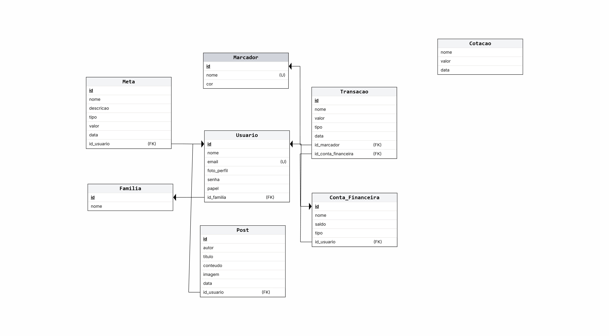
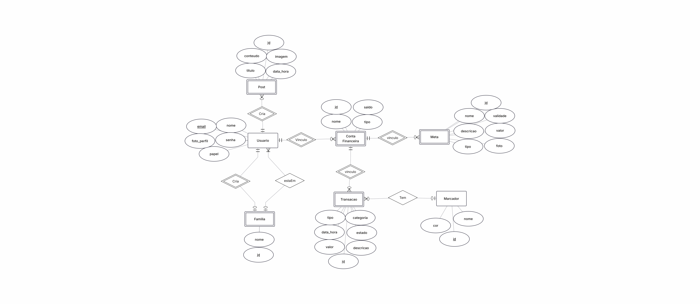

# Modelo de Dados

## Histórico de Revisões

| Data | Versão | Descrição | Autores |
| :--: | :----: | :-------: | :-----: |
| 30/10/2025 | 1.0 | Diagrama | Bruno Dias, Eduardo Medeiros, Lucas Henrique, Pedro Ricardo, Wagner Souza |
| 05/12/2025 | 2.0 | Diagrama atualizado | Bruno Dias, Eduardo Medeiros, Lucas Henrique, Pedro Ricardo, Wagner Souza |
| 25/01/2025 | 3.0 | Diagrama atualizado | Bruno Dias, Eduardo Medeiros, Lucas Henrique, Pedro Ricardo, Wagner Souza |

## 1. Diagrama ER

## 2. Modelo Relacional

## 3. Dicionário de Dados

### Template do Dicionário de Dados de cada Tabela

Tabela : [nome da tabela 1]

*Descrição* : ...

*Observações* : ...

| Colunas          | Descrição             | Tipo de Dado   | Tamanho                   | Null | PK | FK | Unique | Identity | Default                   | Constraints                         |
| ---------------- | --------------------- | -------------- | ------------------------- | ---- | -- | -- | ------ | -------- | ------------------------- | ----------------------------------- |
| [nome da coluna] | [descrição da coluna] | [tipo de dado] | [tamanho - se necessário] |  []  | [] | [] |   []   |    []    | [default - se necessário] | [outras restrições - se necessário] |

---

### Tabela: **Usuário**

*Descrição* : Armazena os dados pessoais do usuários cadastrados

*Observações* : O usuário pode assumir o papel de usuário comum, administrador do site ou administrador de uma família

| Colunas        | Descrição                         | Tipo de Dado | Tamanho | Null | PK | FK | Unique | Identity | Default | Constraints                                           |
| -------------- | ----------------------------------| ------------ | ------- | ---- | -- | -- | ------ | -------- | ------- | ----------------------------------------------------- |
| **id**         | Identificação do usuário          | INTEGER      |    –    |  []  |[X] | [] |   []   |   [X]    |    –    | `id >= 1`                                             |
| **nome**       | Nome do usuário                   | VARCHAR      | 254     |  []  | [] | [] |   []   |    []    |    –    |                         –                             |
| **email**      | E-mail do usuário                 | VARCHAR      | 254     |  []  | [] | [] |  [X]   |    []    |    –    |                         –                             |
| **foto_perfil**| URL da Foto de perfil do usuário  | VARCHAR      | 254     | [X]  | [] | [] |  []    |    []    |    -    |                                                       |
| **senha**      | Senha do usuário                  | VARCHAR      | 254     |  []  | [] | [] |   []   |    []    |    –    | `LENGTH(senha) >= 8`                                  |
| **papel**      | Papel do usuário                  | VARCHAR      | 50      |  []  | [] | [] |   []   |    []    |    –    | `papel IN ('Usuario', 'Admin Site', 'Admin Familia')` |
| **id_familia** | ID da família associada           | INTEGER      |    –    | [X]  | [] |[X] |   []   |    []    |    –    |                         –                             |

### Tabela: Conta Financeira

*Descrição* : Armazena os dados das contas financeiras criadas pelo usuário

*Observações* : ...

| Colunas        | Descrição                       | Tipo de Dado | Tamanho | Null | PK | FK | Unique | Identity | Default | Constraints       |
| -------------- | ------------------------------- | ------------ | ------- | ---- | -- | -- | ------ | -------- | ------- | ----------------- |
| **id**         | Identificação da conta          | INTEGER      |    –    |  []  |[X] | [] |   []   |   [X]    |    –    | `id >= 1`         |
| **nome**       | Nome da conta                   | VARCHAR      | 254     |  []  | [] | [] |   []   |    []    |    –    |         –         |
| **saldo**      | Saldo da conta                  | REAL         | 255     |  []  | [] | [] |   []   |    []    |    –    |         –         |
| **tipo**       | Tipo de conta                   | VARCHAR      | 50      |  []  | [] | [] |   []   |    []    |    –    |         –         |
| **id_usuario** | ID do usuário associado à conta | INTEGER      |    –    |  []  | [] |[X] |   []   |    []    |    –    | `id_usuario >= 1` |

### Tabela: **Transação**

*Descrição* : Armazena os dados das transações financeiras criadas pelo usuário
*Observações* : ...

| Colunas                  | Descrição                           | Tipo de Dado | Tamanho | Null | PK | FK | Unique | Identity | Default    | Constraints                           |
| ------------------------ | ----------------------------------- | ------------ | ------- | ---- | -- | -- | ------ | -------- | ---------- | ------------------------------------- |
| **id**                   | Identificação da transação          | INTEGER      |    –    |  []  |[X] | [] |   []   |   [X]    |      –     | `id >= 1`                             |
| **descricao**            | Descrição da transação              | VARCHAR      | 254     |  []  | [] | [] |   []   |    []    |      –     |                    –                  |
| **valor**                | Valor da transação                  | REAL         | 255     |  []  | [] | [] |   []   |    []    |      –     |                    –                  |
| **categoria**            | Categoria da transação              | VARCHAR      | 50      |  []  | [] | [] |   []   |    []    |      –     | `categoria IN ('ALIMENTACAO', 'EDUCACAO', 'ENTRETENIMENTO', 'FINANCEIRO', 'IMPREVISTOS', 'SAUDE', 'TRABALHO', 'TRANSPORTE', 'OUTROS')` |
| **estado**               | Estado da transação                 | VARCHAR      | 50      |  []  | [] | [] |   []   |    []    | 'Realizada'| `estado IN ('Pendente', 'Realizada')` |
| **tipo**                 | Tipo da transação                   | VARCHAR      | 50      |  []  | [] | [] |   []   |    []    |      –     |   `tipo IN ('Receita', 'Despesa')`    |
| **data_hora**            | Data e hora da transação            | TIMESTAMP    |    –    |  []  | [] | [] |   []   |    []    |      –     |                    –                  |
| **id_marcador**          | ID dos marcadores da transação      | INTEGER      |    –    | [X]  | [] |[X] |   []   |    []    |      –     |                    –                  |
| **id_conta_financeira**  | ID associado à conta financeira     | INTEGER      |    –    |  []  | [] |[X] |   []   |    []    |      –     |                    –                  |

### Tabela: **Marcador**

*Descrição* : Armazena os dados dos marcadores criados pelo usuário

*Observações* : ...

| Colunas        | Descrição                            | Tipo de Dado | Tamanho | Null | PK | FK | Unique | Identity | Default | Constraints |
| -------------- | ------------------------------------ | ------------ | ------- | ---- | -- | -- | ------ | -------- | ------- | ----------- |
| **id**         | Identificação do marcador            | INTEGER      |    –    |  []  |[X] | [] |   []   |   [X]    |    –    |      –      |
| **nome**       | Nome do marcador                     | VARCHAR      | 100     |  []  | [] | [] |  [X]   |    []    |    –    |      –      |
| **cor**        | Cor do marcador                      | VARCHAR      |    –    |  []  | [] | [] |   []   |    []    |    –    |      –      |

### Tabela : **Família**

*Descrição* : Armazena os dados de uma Família que foi criada por um usuário

*Observações* : A Família precisa ter pelo menos 2 membros e inicialmente o usuário que a criou se torna um administrador da família

| Colunas  | Descrição                | Tipo de Dado | Tamanho | Null | PK | FK | Unique | Identity | Default | Constraints |
| -------- | ------------------------ | ------------ | ------- | ---- | -- | -- | ------ | -------- | ------- | ----------- |
| **id**   | Identificação da família | INTEGER      |    –    |  []  |[X] | [] |   []   |   [X]    |    –    |      –      |
| **nome** | Nome da família          | VARCHAR      | 254     |  []  | [] | [] |  [X]   |    []    |    –    |      –      |

### Tabela: **Post**

*Descrição* : Armazena os dados de um post criado por um usuário

*Observações* : O usuário precisa de ter o papel de administrador do site

| Colunas        | Descrição                       | Tipo de Dado | Tamanho | Null | PK | FK | Unique | Identity | Default | Constraints       |
| -------------- | ------------------------------- | ------------ | ------- | ---- | -- | -- | ------ | -------- | ------- | ----------------- |
| **id**         | Identificação do post           | INTEGER      |    –    |  []  |[X] | [] |   []   |   [X]    |    –    | `id >= 1`         |
| **titulo**     | Título do post                  | VARCHAR      | 255     |  []  | [] | [] |   []   |    []    |    –    |         –         |
| **conteudo**   | Conteúdo do post                | VARCHAR      | 500     |  []  | [] | [] |   []   |    []    |    –    |         –         |
| **imagem_url** | URL para acessar a imagem       | VARCHAR      | 255     | [X]  | [] | [] |   []   |    []    |    –    |         –         |
| **data**       | Data da publicação              | TIMESTAMP    |    –    |  []  | [] | [] |   []   |    []    |    –    |         –         |
| **id_usuario** | ID do usuário associado ao post | INTEGER      |    –    |  []  | [] |[X] |   []   |    []    |    –    | `id_usuario >= 1` |

### Tabela: **Meta**

*Descrição* : Armazena os dados de uma meta criada por um usuário

*Observações* : ...

| Colunas                 | Descrição                      | Tipo de Dado | Tamanho | Null | PK | FK | Unique | Identity | Default | Constraints       |
| ----------------------- | ------------------------------ | ------------ | ------- | ---- | -- | -- | ------ | -------- | ------- | ----------------- |
| **id**                  | Identificação da meta criada   | INTEGER      |    –    |  []  |[X] | [] |   []   |   [X]    |    –    | `id >= 1`         |
| **nome**                | Nome da meta                   | VARCHAR      | 254     |  []  | [] | [] |   []   |    []    |    –    |         –         |
| **descricao**           | Descrição da meta              | VARCHAR      | 500     | [X]  | [] | [] |   []   |    []    |    –    |         –         |
| **tipo**                | Tipo da meta                   | VARCHAR      | 50      |  []  | [] | [] |   []   |    []    |    –    |         –         |
| **valor**               | Valor de objetivo para a meta  | REAL         | 255     |  []  | [] | [] |   []   |    []    |    –    |         –         |
| **data_hora**           | Data e hora de criação da meta | TIMESTAMP    | 10      |  []  | [] | [] |   []   |    []    |    –    |         –         |
| **id_conta_financeira** | ID do usuário que criou a meta | INTEGER      |    –    |  []  | [] |[X] |   []   |    []    |    –    | `id_usuario >= 1` |

### Tabela: **Cotação**

*Descrição* : Armazena os dados de uma cotação criada por um usuário

*Observações* : O usuário precisa ter o papel de administrador do site

| Colunas   | Descrição                | Tipo de Dado | Tamanho | Null | PK | FK | Unique | Identity | Default | Constraints |
| --------- | ------------------------ | ------------ | ------- | ---- | -- | -- | ------ | -------- | ------- | ----------- |
| **id**    | Identificação da cotação | INTEGER      |    –    |  []  |[X] | [] |   []   |   [X]    |    –    |      –      |
| **nome**  | Nome da moeda            | VARCHAR      | 120     |  []  | [] | [] |  [X]   |    []    |    –    |      –      |
| **valor** | Valor da moeda           | FLOAT        | 10      |  []  | [] | [] |   []   |    []    |    –    | `valor > 0` |
| **data**  | Data da cotação          | TIMESTAMP    | 14      |  []  | [] | [] |   []   |    []    |    –    |      –      |
