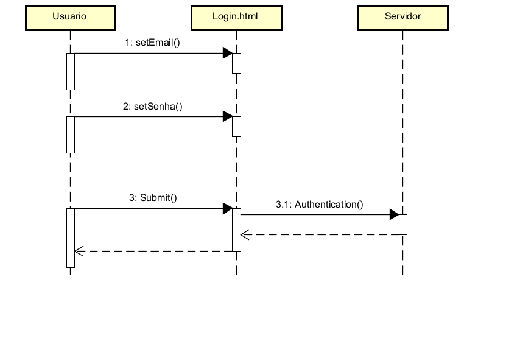

# CDU 01. Login

- **Ator principal**: Visitante

- **Atores secundários**: N/A.
- **Resumo**:  O caso de uso Login permite que um usuário já cadastrado acesse o sistema utilizando suas credenciais. O processo começa quando o usuário informa seu e-mail e senha na tela de login. O sistema verifica se os dados correspondem a um usuário existente e se a conta está ativa. Se as informações estiverem corretas, o sistema concede acesso e cria uma sessão. Caso contrário, o acesso é negado e uma mensagem de erro é exibida solicitando a correção dos dados.
- **Pré-condição**:  Não deve esta autenticado.
- **Pós-Condição**:  É autenticado no sistema.

## Fluxo Principal

| Ações do Ator | Ações do Sistema |
| :-----------------: | :-----------------: |
| 1.  Acessa a tela de [Login](https://www.figma.com/proto/hbbNIiCbHjSmDtWXFRDvgs/Na-Ponta-do-Lapis?node-id=1545-21654&t=gZFvJtLbjEaf6iYW-0&scaling=min-zoom&content-scaling=fixed&page-id=625%3A100&starting-point-node-id=1545%3A21654). | |
| 2. Informa o email e a senha nos campos do formulário. | |
| | 3. Sistema recebe as credenciais. |
| | 4. Valida o formato do email e verifica se todos os campos foram preenchidos. |
| | 5.  Verifica a existência do usuário no banco de dados. |
| | 6.  Valida a senha informada comparando com a senha armazenada. |
| | 7.  Autentica. |
| | 8.  Cria uma sessão válida. |
| | 9.  Redireciona para a [Pagina inicial](https://www.figma.com/proto/hbbNIiCbHjSmDtWXFRDvgs/Na-Ponta-do-Lapis?node-id=1545-21660&t=gZFvJtLbjEaf6iYW-0&scaling=min-zoom&content-scaling=fixed&page-id=625%3A100&starting-point-node-id=1545%3A21654). |

## Fluxo Alternativo I - Credenciais invalidas ou inexistentes

| Ações do ator | Ações do sistema |
| :-----------------: |:-----------------: |
| 1.1 -  Informa email ou senha incorreto | |
| | 1.2 -  Retorna um feedback informando que a email, senha ou usuario não esta cadastrado |

## Diagrama de Interação (Sequência ou Comunicação)

