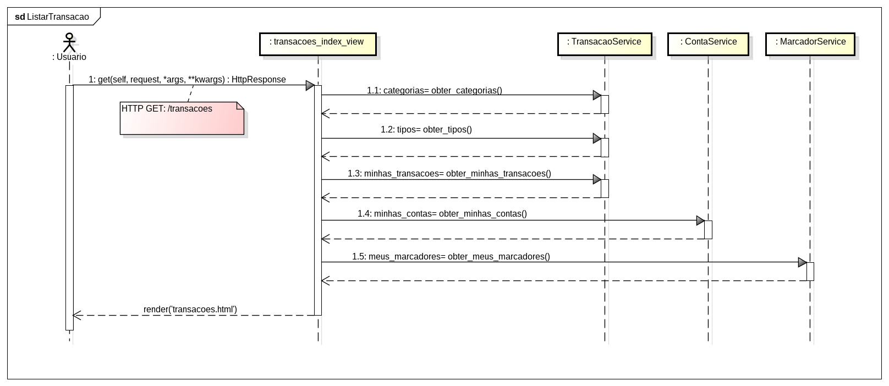
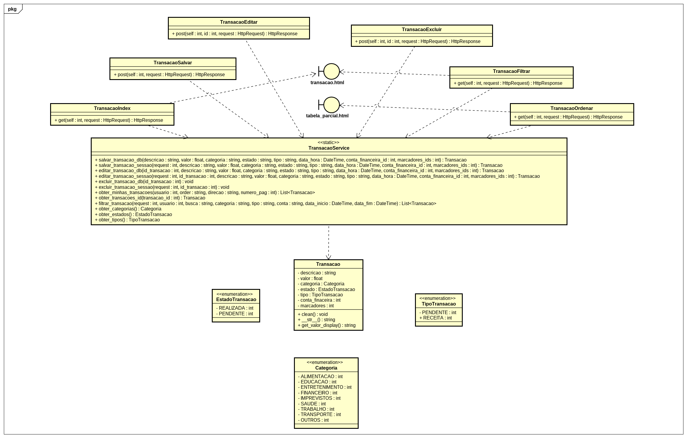

# CDU 18. Manter Transação 

- **Ator principal**: Cliente
- **Atores secundários**: Sistema de Banco de Dados
- **Resumo**: O sistema exibe um formulário com os campos necessários (*descrição, *valor, categoria, *status de pagamento/recebimento, *data, marcador, *conta) para criar, editar ou excluir uma transação. O Cliente preenche todos os campos obrigatórios e confirma a operação.
- **Pré-condição**: O Cliente deve estar autenticado no sistema para registrar uma transação.
- **Pós-condição**: O sistema persiste os dados da transação no banco de dados e exibe uma mensagem de confirmação.

## Fluxo Principal

| Ações do ator | Ações do sistema |
| :-: | :-: |
| 1 - Cliente clica no botão "Transações" ou no botão de acesso rápido | |  
| | 2 - Sistema exibe um formulário com os campos (*descrição, *valor, *categoria, *status de pagamento/recebimento, *data, marcador, *conta) necessários para completar o cadastro de transação |
| 3 - Cliente preenche os campos obrigatórios e clica em "Salvar" | |
| | 4 - Sistema valida os dados informados |
| | 5 - Sistema persiste a transação no banco de dados e exibe mensagem de confirmação: "Transação salva com sucesso" |

## Fluxo Alternativo I - Editar Transação

| Ações do ator | Ações do sistema |
| :-: | :-: |
| 1.2 - Cliente seleciona uma transação existente e clica no ícone de edição | |
| | 2.2 - Sistema exibe o formulário pré-preenchido com os dados da transação |
| 3.2 - Cliente altera os dados desejados e clica em "Salvar" | |
| | 4.2 - Sistema valida os dados e persiste as alterações |
| | 5.2 - Sistema exibe mensagem de confirmação: "Transação atualizada com sucesso" |

## Fluxo Alternativo II - Excluir Transação

| Ações do ator | Ações do sistema |
| :-: | :-: |
| 1.3 - Cliente seleciona uma transação existente e clica no ícone de lixeira para excluir | |
| | 2.3 - Sistema exibe um pop-up de confirmação com a mensagem: "Deseja realmente excluir esta transação?" |
| 3.3 - Cliente confirma a exclusão | |
| | 4.3 - Sistema remove a transação do banco de dados |
| | 5.3 - Sistema atualiza automaticamente o gráfico e a tabela de transações, refletindo a exclusão |
| | 6.3 - Sistema exibe mensagem de confirmação: "Transação excluída com sucesso" |

## Fluxo Exceção - Validação de Dados com Erro

| Ações do ator | Ações do sistema |
| :-: | :-: |
| | 4.1 - Sistema identifica que um ou mais campos foram preenchidos de forma incorreta e exibe mensagem de erro (ex: "Campo obrigatório", "Valor deve ser positivo") |
| | 4.2 - Sistema retorna ao passo 3 do fluxo principal para corrigir os dados |

## Diagrama de Interação (Sequência ou Comunicação)

## Diagrama de Classes de Projeto

