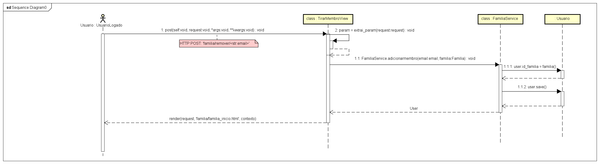
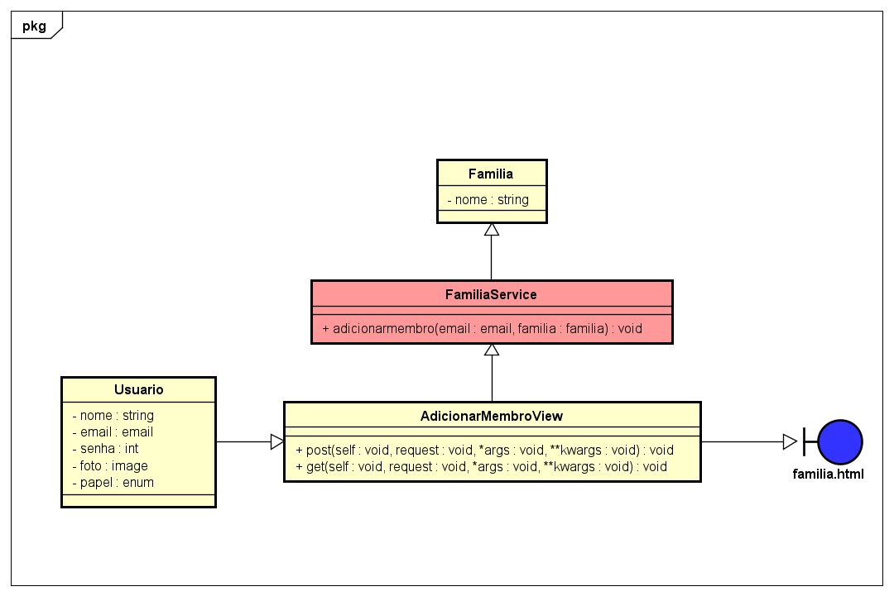

# CDU 22. Adicionar membro à família

- **Ator principal**: Usuário.

- **Atores secundários**: Não existe.
- **Resumo**:  Na página “Grupo Familiar” o usuário aperta o botão “adicionar” para adicionar um novo membro à sua família, caso ainda não tenha membros a família será criada.
- **Pré-condição**: Usuário deve estar cadastrado e autenticado no sistema.
- **Pós-Condição**: Um membro é adicionado na sua família; uma família é criada e o usuário criador recebe o papel admin família.

## Fluxo Principal

| Ações do ator | Ações do sistema |
| :-----------------: | :-----------------: |
| 1 - O usuário aperta o botão "adicionar". | |
| | 2 - Se o usuário já tiver uma família, o sistema retorna um formulário. |
| 3 - O usuário preenche o formulário com as informações do novo membro e aperta "concluir". | |
| | 4 - O sistema vincula a conta do novo membro à familia, persiste as informaçôes e retorna um pop-up escrito "adicionado com sucesso". |

## Fluxo Alternativo I - Adicionar primeiro membro

| Ações do ator | Ações do sistema |
| :-----------------: |:-----------------: |
| | 2.1 - O sistema retorna um fomulário para criar a família. |
| 3.1 - O usuário preenche e aperta o botão "criar". | |
| | 4.1 - Aparece um pop-up confirmando a criação da família, o sistema persiste os dados de criação da família e o usuário recebe o papel admin família. |
| 5.1 - (retorna para o passo 2 do fluxo principal) | |

## Fluxo Alternativo II - Dado do formulário inválido

| Ações do ator | Ações do sistema |
| :-----------------: | :-----------------: |
| | 4.2 - O sistema retorna uma mensagem "Dado(s) Inválido(s)" e mostra novamente o formulário com o/os campo/os inválido/os em vermelho com uma pequena mensagem em vermelho embaixo do campo. |
| 5.2 - (retorna para o passo 3 do fluxo principal) | |

> Obs. as seções a seguir apenas serão utilizadas na segunda unidade do PDSWeb (segundo orientações do gerente do projeto).

## Diagrama de Interação (Sequência ou Comunicação)

## Diagrama de Classes de Projeto

