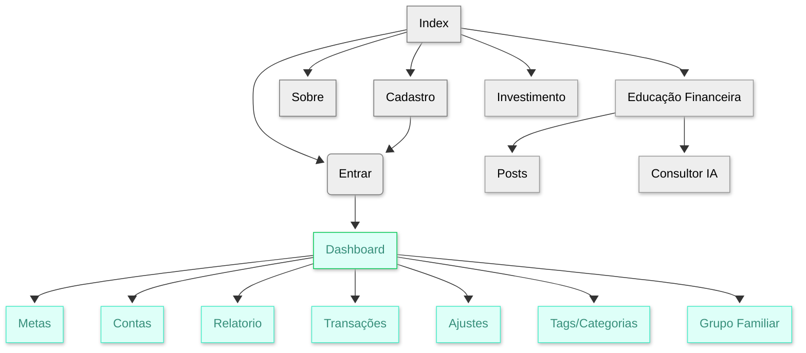

# Protótipos de Interface com o Usuário

## Histórico de Revisões

| Data | Versão | Descrição | Autores |
| :--: | :----: | :-------: | :-----: |
| 09/10/2025 | 0.1 | Versão inicial | Bruno |
| - | - | - |  - |

## 1. Mapa do Site
>Versão de prototipo

### Protótipo de baixa fidelidade
[Link para vizualização no Figma](https://www.figma.com/design/hbbNIiCbHjSmDtWXFRDvgs/Na-Ponta-do-Lapis?node-id=87-4&t=MZDT6lo0g5vAUEoe-1)
### A. Tela 1: Index
> Obs. Substituir pela captura das imagens, sejam elas provenientes do Figma (anexar também o link para o Figma) ou já em HTML e CSS...

### B. Tela 2: Login

> Obs. Substituir pela captura das imagens, sejam elas provenientes do Figma (anexar também o link para o Figma) ou já em HTML e CSS...
